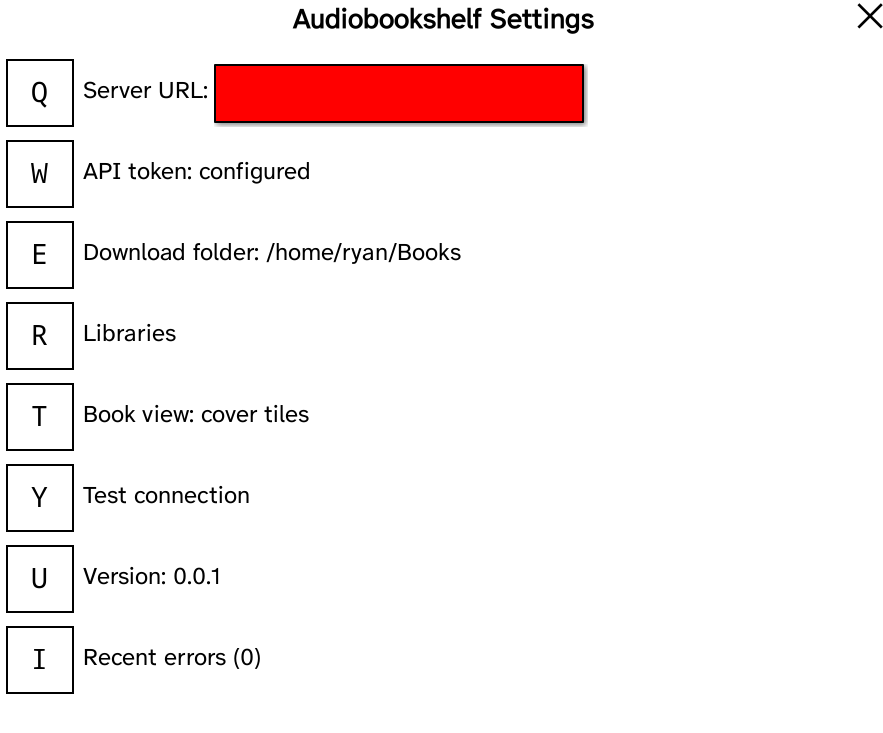
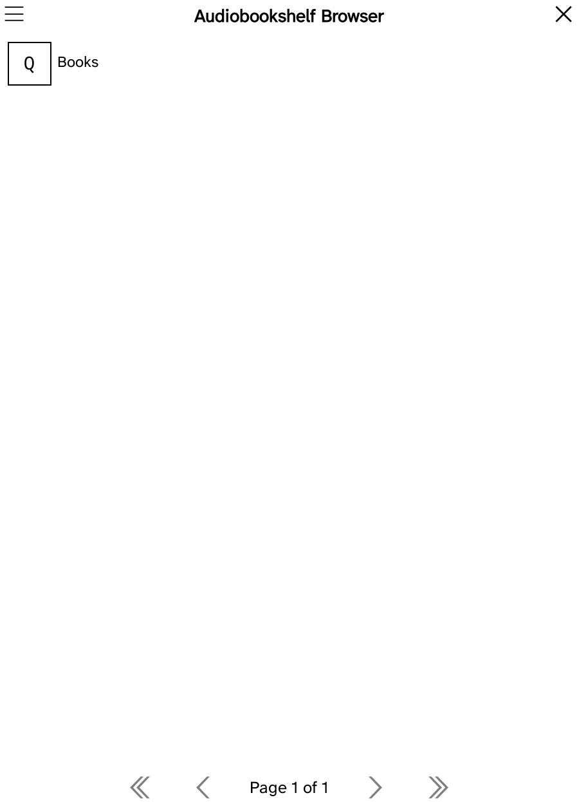
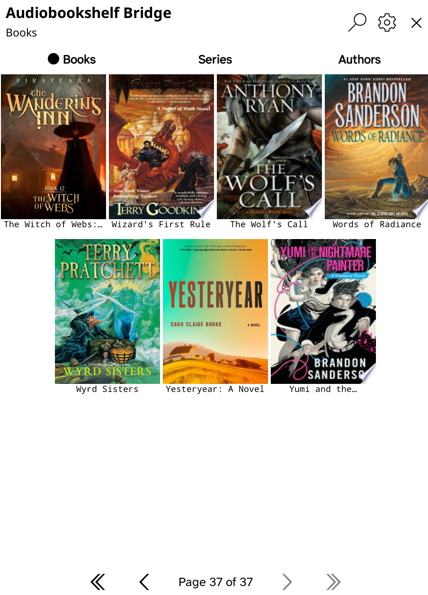
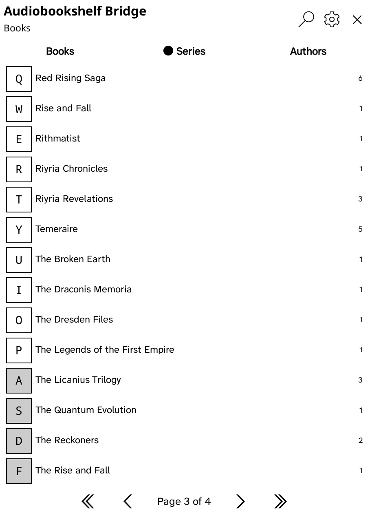
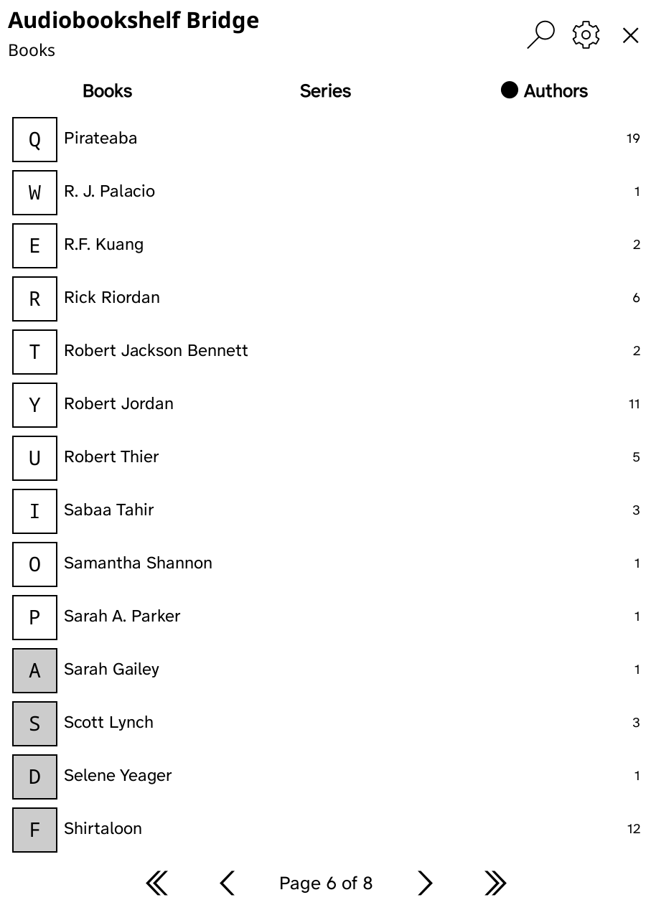
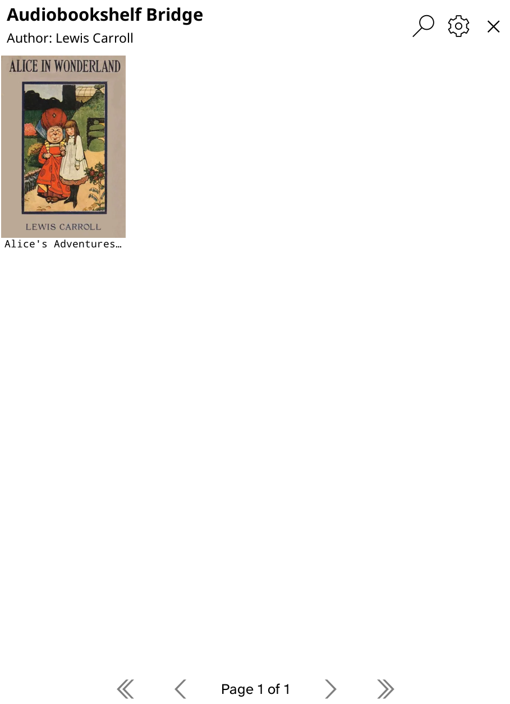

# Audiobookshelf Bridge for KOReader

A KOReader plugin that browses an [Audiobookshelf](https://www.audiobookshelf.org/)
server and downloads ebooks straight to your e-reader.

A book you can find in Audiobookshelf, you can find and download on the reader —
and once it lands, its metadata matches what Audiobookshelf says.

Originally inspired by [naleo's Audiobookshelf plugin for KOReader](https://github.com/naleo/audiobookshelf.koplugin).

## Requirements

- KOReader (2025 or newer)
- An Audiobookshelf server the device can reach over the network, and an account on it

## Install

1. Download `audiobookshelfbridge.koplugin.zip` from the
   [latest release](https://github.com/theryanmc/audiobookshelfbridge/releases/latest).
2. Unzip it into KOReader's `plugins` directory. Common locations:

   | Platform | Path |
   |----------|------|
   | Kobo | `.adds/koreader/plugins/` |
   | Kindle | `koreader/plugins/` |
   | Android | `koreader/plugins/` |
   | Linux | `~/.config/koreader/plugins/` |
   | Linux (Flatpak) | `~/.var/app/rocks.koreader.KOReader/config/koreader/plugins/` |

3. Restart KOReader.

**Keep the folder name `audiobookshelfbridge.koplugin`.** KOReader only loads
plugin directories whose name ends in `.koplugin`; renaming it means the plugin
is silently ignored, with no error to tell you why.

## Get an API token

The plugin authenticates as your Audiobookshelf user, so it needs that user's
API token.

In the Audiobookshelf web interface, open **Settings → Users** and select your
user — the API token is shown on that page. Newer server versions manage these
under **Settings → API Keys** instead.

Treat the token like a password: it grants access to your library.

## Configure

Open **Tools → Audiobookshelf Bridge**, then tap the **Settings** gear in the
top right.



| Setting | What it does |
|---------|--------------|
| **Server URL** | Your Audiobookshelf address, including the scheme — `https://books.example.com`. Must start with `http://` or `https://`. |
| **API token** | The token from the step above. Shows `configured` once set, never the value. |
| **Download folder** | Where downloaded ebooks are saved. |
| **Libraries** | Hide libraries you don't want in the browser. |
| **Book view** | `cover tiles` or `list`. |
| **Test connection** | Checks the URL and token together and reports which one failed. |
| **Recent errors** | Failures recorded this session — the first place to look when something doesn't work. |

Set the server URL and token, then use **Test connection** to confirm both
before browsing.

### Configuring from a file instead

Settings live in `audiobookshelfbridge_config.lua` inside the plugin folder. To
pre-seed a device, copy `audiobookshelfbridge_config.example.lua` to that name
and fill it in:

```lua
return {
    ["token"] = 'your api key here',
    ["server"] = 'https://books.example.com'
}
```

The plugin also writes `download_dir` and `disabled_libraries` into this file as
you change them. Neither needs to be present up front.

This file holds your API token in plain text. It is already listed in
`.gitignore` and excluded from release archives — keep it out of anything you
publish or share.

## Using it

**Tools → Audiobookshelf Bridge** opens the browser directly.



Pick a library, and its books appear as cover tiles. Tap one for its details,
then choose a file to download.

### Browse books, series, and authors

Use **Books | Series | Authors** below the header to browse the library.
The filled dot marks the active tab.

- **Books** shows ebook covers and titles. Switch to a text list with
  **Settings → Book view** if you prefer.
- **Series** lists series with ebooks in this library, with ebook counts on
  the right. Tap a series to open its books.
- **Authors** lists authors with ebooks in this library, also with ebook counts
  on the right. Tap an author to see their books, as shown for Lewis Carroll
  below.

When you open a series or author, the location below the header identifies the
group you are viewing. Tap **✕** to return to the originating tab.
Each tab remembers its page while the library is open. The first visit to Series
or Authors loads their metadata in batches; subsequent tab switches use the
cached results until you reopen the library.

| Books: cover tiles | Series: names and ebook counts |
|:------------------:|:-----------------------------:|
|  |  |

| Authors: names and ebook counts | Books by a selected author |
|:------------------------------:|:--------------------------:|
|  |  |

### Navigation and search

If only one library is enabled, the browser opens it directly. The X button
then closes the plugin from that library's book list.

| Control | Action |
|---------|--------|
| **Search** (magnifying glass, top right) | Search this library |
| **Settings** (gear, top right) | Open Settings |
| **✕** (top right) | Back one level; closes the plugin at the top level |
| **‹ / ›** (single arrows, bottom) | Previous / next page |
| **« / »** (double arrows, bottom) | First / last page |
| Multi-swipe | Closes the browser from any depth |

The page indicator shows your position in the current list. Arrows are grayed
out when there is no page to move to in that direction.

The header keeps the plugin name on the left, with the current location below it.
Search is scoped to the library you are in and only appears once you have opened
one. Results list matching authors and series alongside
books.

## Notes

- **Covers are cached to disk.** The first view of a page fetches them and shows
  a loading notice; later visits draw from the cache. A cover that fails to
  download is refetched next time rather than cached as broken.
- **Downloads and cover fetches block the UI.** KOReader is single-threaded and
  the Audiobookshelf API is called synchronously, so the reader is unresponsive
  while a page of covers or a book is transferring.
- **Wi-Fi failures are expected.** When something fails, check
  **Settings → Recent errors** for what the server actually said.

## Security notes

Things worth knowing before you point this at a server you care about.

- **Your API token is stored in plain text** in `audiobookshelfbridge_config.lua`
  inside the plugin folder, with ordinary file permissions. On a single-user
  e-reader that is fine. On a shared computer, anyone with access to your
  files can read it.
- **Use `https://`.** Over `http://` the token is sent unencrypted on every
  request. The plugin warns once when you save an `http://` address.
- **KOReader does not verify TLS certificates.** Its bundled HTTPS library
  ships with verification turned off, and this plugin inherits that. `https://`
  still protects you from passive eavesdropping, but not from an attacker who
  can sit between the device and your server. This is a KOReader platform
  limitation; the plugin cannot fix it on its own.
- **Redirects are refused.** The plugin never follows an HTTP redirect, so a
  captive-portal Wi-Fi network that redirects every request to its sign-in
  page cannot be handed your token. If you see "the server redirected the
  request", sign in to the network first or check the URL.
- **Tokens never appear in logs or on screen.** The settings screen shows
  `configured`, never the value; the token entry field is masked; and the
  Recent errors list is built to never contain a token, header, or response
  body.

## Development and releases

The root contains KOReader's entry points (`main.lua` and `_meta.lua`), the
version file, and the example configuration. Runtime modules live in
`audiobookshelfbridge/`; screenshots live in `docs/screenshots/`.

Run `python3 scripts/package_release.py` to build
`dist/audiobookshelfbridge.koplugin.zip`. The script packages only explicitly
listed files and checks that internal imports are included. When adding a
runtime module, also add it to the script's file list.

`audiobookshelfbridge_version.lua` is the release version's single source of
truth. To release, update it and `CHANGELOG.md`, then push to `main`. CI builds
the archive and publishes the matching `vMAJOR.MINOR.PATCH` tag. If that tag
already exists, CI validates the package without publishing another release.

## License

MIT — see [LICENSE](LICENSE).
